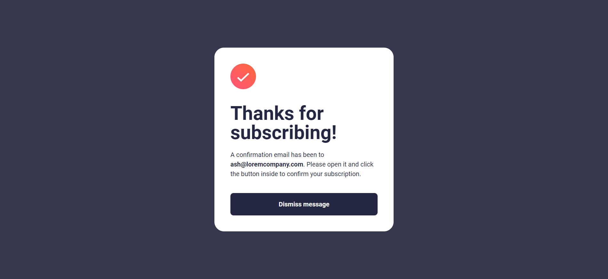

# Newsletter sign-up form with success message

A simple newsletter sign-up form with a success message built using HTML, Tailwind CSS, and JavaScript.

## Screenshots

## Live Site

Check out the live site [here](https://newsletter-s1gnup.netlify.app/).

## Features

- Simple and intuitive newsletter sign-up form.
- Success message displayed upon successful form submission.
- Responsive design using Tailwind CSS.

## Email Validation

The email input in the form is validated to ensure that a properly formatted email address is entered. The validation is done using a regular expression pattern. The pattern used in this project checks for the basic structure of an email address but does not cover all possible edge cases. For more comprehensive email validation, additional techniques or libraries can be used.

## Installation

To install and run the project locally, follow these steps:

1. Make sure you have Node.js installed on your machine.
2. Clone the repository: `git clone https://github.com/your-username/newsletter-signup.git`
3. Navigate to the project directory: `cd newsletter-signup`
4. Install the dependencies: `npm install`
5. Start the development server: `npm run dev`
6. Open your web browser and visit `http://localhost:3000` to see the application in action.

## Contributing

Contributions are welcome! If you would like to contribute to this project, please follow these steps:

1. Fork the repository.
2. Create a new branch for your feature or bug fix.
3. Commit your changes.
4. Push your branch to your forked repository.
5. Submit a pull request.

## License

This project is licensed under the [MIT License](LICENSE).
